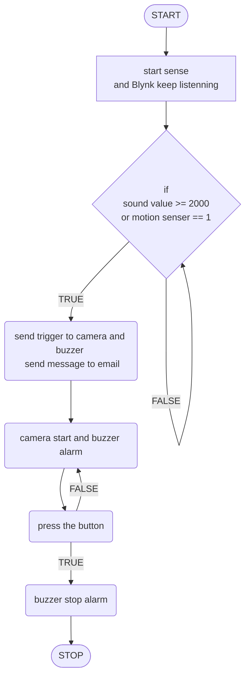

# Flow Diagram

```mermaid
flowchart TD

start([START])
--> 

step1[start sense \n and Blynk keep listenning]
-->

condition1{if \n sound value >= 2000 \n or motion senser == 1}
condition1 --> |FALSE| condition1
condition1--> |TRUE| result1(send trigger to camera and buzzer \n send message to email )
--> 

step2(camera start and buzzer alarm)
--> 

condition2(press the button)
condition2 --> |TRUE|step3(buzzer stop alarm)
condition2 --> |FALSE|step2 

step3 -->
stop([STOP])


```