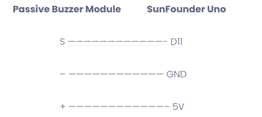
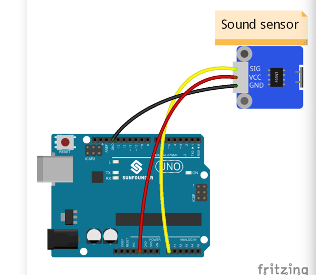
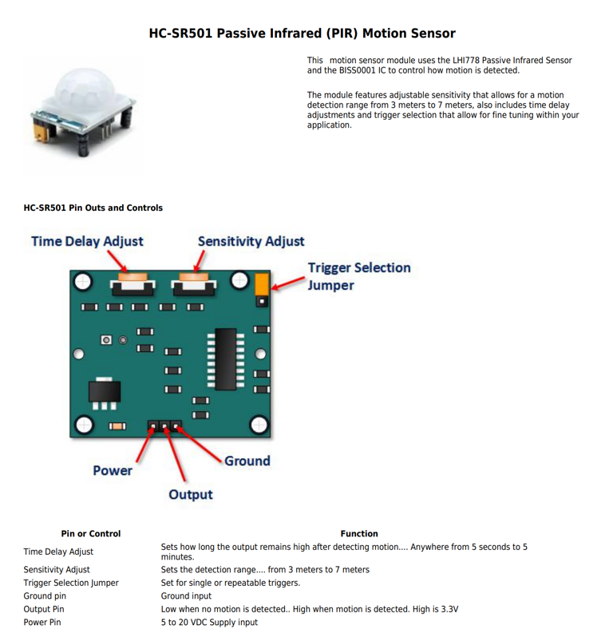

This is the circuit design directory

#### ESP32 cam

sundfounder passive buzzer
https://learn.sunfounder.com/lesson-12-buzzer/

sunfounder sound sensor
https://learn.sunfounder.com/lesson-27-sound-sensor/

hw416b pir sensor
https://www.taydaelectronics.com/datasheets/files/A-4432.pdf

hw-dy02 DC transformer module
https://www.thingiverse.com/thing:3346074

MAX9814 Electret Microphone Amplifier Board -  
https://www.analog.com/media/en/technical-documentation/data-sheets/max9814.pdf

