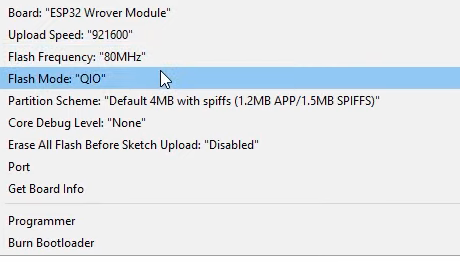
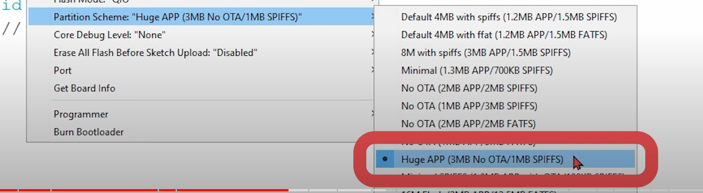

This is the circuit design directory

## ESP32 cam

#### How to connect 

1. set up cam on breadbord. make sure the reset button can be reach.
2. connect red line to 5V pin on cam
3. connect black line to GND pin
4. green RXwire to TXD pin labeled UOR
5. yellow TXwire to RXD pin to UOT
6. into boot mode : 1 jump wire from IO0 to GND
7. make sure following info is correct

**this info should not same as what we just use. so we need search** 

8. select huge app

sundfounder passive buzzer
https://learn.sunfounder.com/lesson-12-buzzer/  

sunfounder sound sensor
https://learn.sunfounder.com/lesson-27-sound-sensor/  

hw416b pir sensor
https://www.taydaelectronics.com/datasheets/files/A-4432.pdf  

hw-dy02 DC transformer module
https://www.thingiverse.com/thing:3346074  

MAX9814 Electret Microphone Amplifier Board -  
https://www.analog.com/media/en/technical-documentation/data-sheets/max9814.pdf

