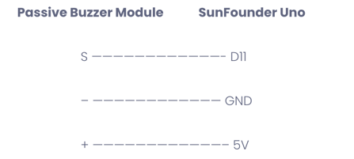

This is the circuit design directory

## ESP32 cam

sundfounder passive buzzer
https://learn.sunfounder.com/lesson-12-buzzer/  

sunfounder sound sensor
https://learn.sunfounder.com/lesson-27-sound-sensor/  

hw416b pir sensor
https://www.taydaelectronics.com/datasheets/files/A-4432.pdf  

hw-dy02 DC transformer module
https://www.thingiverse.com/thing:3346074  

MAX9814 Electret Microphone Amplifier Board -  
https://www.analog.com/media/en/technical-documentation/data-sheets/max9814.pdf

## other one to show how to make a local web page to show the cam stream (not use this code)
https://randomnerdtutorials.com/esp32-cam-take-photo-display-web-server/

## How to set up firebase to save pic
https://randomnerdtutorials.com/esp32-cam-save-picture-firebase-storage/

## How to set up firebase web app to view the last photo 
https://randomnerdtutorials.com/esp32-cam-display-pictures-firebase-web-app/#firebaseconfig-object

## firebase web app
https://esp32-smartpants.web.app

## github repository
https://github.com/feix0033/EASV_C21_4thSemester_IoT_SmartyPants_SecurityEquipments.git

## blynk dashboard
https://blynk.cloud/dashboard/25123/products
